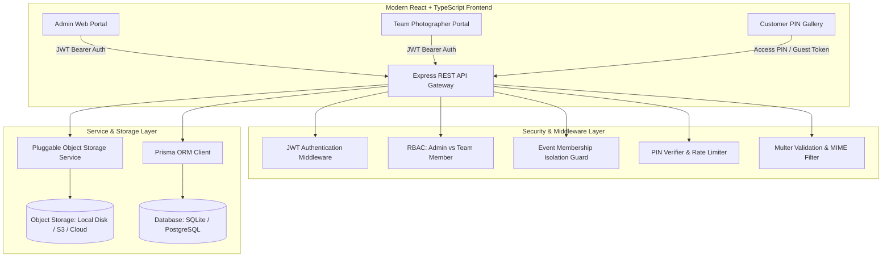
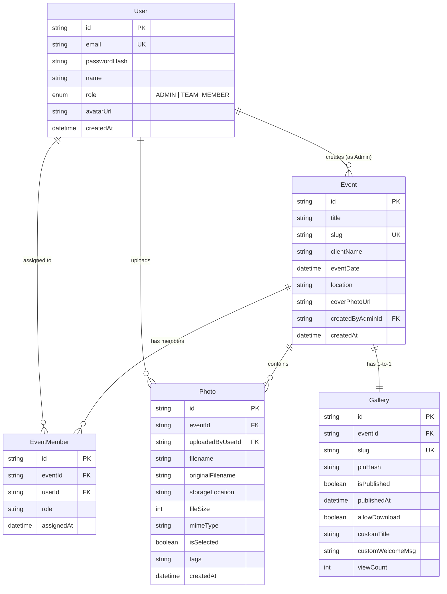

# 📸 LuminaPhoto - Collaborative Event Photo Sharing Platform

> A full-stack, enterprise-grade photography platform designed for professional photography teams to collaboratively upload event captures, curate client selections, and publish luxury PIN-protected customer galleries.

---

## 🌟 Live Demo Credentials & Quick Links

| Role | Email | Password | Access / Scope |
| :--- | :--- | :--- | :--- |
| **👑 Lead Admin** | `admin@lumina.photos` | `Admin@123456` | Full system control, event creation, team management, curation & publishing |
| **📷 Team Member 1** | `photographer1@lumina.photos` | `Team@123456` | Assigned to *Arjun & Priya Wedding* & *Tech Summit*; upload & view captures |
| **📷 Team Member 2** | `photographer2@lumina.photos` | `Team@123456` | Assigned to *Arjun & Priya Wedding*; upload & view captures |
| **📷 Team Member 3** | `photographer3@lumina.photos` | `Team@123456` | Assigned to *Arjun & Priya Wedding*; candid/drone shooter |

### 🔒 Customer Demo Gallery (No Account Required)
- **Direct Link**: `http://localhost:5173/gallery/arjun-priya-wedding`
- **Access PIN**: `482917`

---

## 📐 System Architecture



---

## 🚀 Key Features

### 1. 👑 Admin / Studio Lead
- **Event Creation & Workspace Setup**: Create events with client names, dates, venues, and descriptions.
- **Team Assignment**: Assign multiple photographers with customized roles (e.g. *Lead Candid*, *Ceremony Specialist*, *Drone Pilot*).
- **Collaborative Curation Engine**: 1-click select/deselect, multi-select toolbar (*Select All*, *Deselect All*), filter by photographer or selection status.
- **PIN-Protected Publishing**: Generate randomized or custom 6-digit access PINs (bcrypt hashed), customize welcome messages, set download permissions, and toggle live/draft status.
- **Live Shareable Links**: Instant 1-click copyable customer URLs.

### 2. 📷 Team Members (Photographers)
- **Role-Based Isolation**: Access strictly restricted to assigned events (accessing unassigned events returns `403 Forbidden`).
- **Batch Drag & Drop Uploader**: Upload up to 50 photos simultaneously with real-time thumbnail previews, file size indicators, and progress tracking.
- **Ownership Controls**: View all event uploads while only being able to manage/delete their own uploads.
- **Publishing Lock**: Prevented from publishing galleries or modifying event configurations.

### 3. 👥 Customer (Guest View)
- **Zero-Friction Access**: No account creation required. Access via direct link + PIN.
- **PIN Security Screen**: Keypad interface with error shake animations, brute-force rate-limiting, and signed ephemeral guest session tokens (`24h` expiry).
- **Luxury Showcase**: Responsive masonry grid displaying only Admin-curated photos.
- **Cinematic Lightbox**: Fullscreen viewer with zoom, slide counter, and keyboard navigation.
- **Batch ZIP Downloader**: 1-click download of the complete album in a high-resolution `.ZIP` package.

---

## 🗄️ Database Schema Design



---

## 🔒 Security Architecture

| Security Domain | Implementation Details |
| :--- | :--- |
| **Authentication** | JSON Web Tokens (JWT) signed with HMAC-SHA256, 7-day user sessions. |
| **Password & PIN Hashing** | Bcrypt with 10 salt rounds for user passwords and gallery PINs. |
| **Customer Authorization** | Guest JWT tokens issued only upon valid PIN verification, scoped exclusively to that event slug. |
| **Brute Force Protection** | Express rate limiter restricting PIN unlock attempts to 15 tries per 15 minutes per IP. |
| **Data Leak Prevention** | Public endpoints query `isSelected: true` only, ensuring draft captures are never exposed. |
| **Event Isolation** | RBAC middleware strictly enforces `EventMember` check for Team Members (`403 Forbidden` on breach). |
| **Object Storage Integrity** | Multer file validation with strict MIME type checking (`image/jpeg`, `image/png`, `image/webp`, `image/svg+xml`, `image/avif`) and 25MB file size limits. |

---

## 🛠️ Technology Stack

- **Backend**: Node.js, Express, TypeScript
- **Database & ORM**: Prisma ORM with SQLite (compatible with PostgreSQL/MySQL in production)
- **File Storage**: Pluggable Object Storage Architecture (Local Object Storage Gateway + AWS S3 adapter)
- **Frontend**: React 18, Vite, TypeScript, Tailwind CSS, Lucide React, Canvas Confetti
- **Testing**: Vitest & Supertest (21 automated integration & security test suites)

---

## 💻 Local Setup Instructions

### Prerequisites
- Node.js (v18+)
- npm (v9+)

### 1. Clone & Install Dependencies
```bash
# Clone the repository
git clone https://github.com/your-username/photo-sharing-platform.git
cd photo-sharing-platform

# Install root, backend, and frontend packages
npm run install:all
```

### 2. Configure Environment Variables
The repository includes preconfigured defaults in `server/.env`:
```env
PORT=5000
DATABASE_URL="file:./dev.db"
JWT_SECRET="lumina_photo_super_secure_jwt_secret_key_2026"
CLIENT_URL="http://localhost:5173"
UPLOAD_DIR="./uploads"
STORAGE_PROVIDER="local"
NODE_ENV="development"
```

### 3. Initialize & Seed Database
```bash
# Push schema and seed demo accounts & published wedding gallery
npm run setup
```

### 4. Run Development Servers
```bash
# Start both backend (Port 5000) and frontend (Port 5173) concurrently
npm run dev
```

Visit **`http://localhost:5173`** in your browser.

---

## 🧪 Automated Testing

The project includes an automated test suite verifying all authentication, RBAC, event isolation, curation, and customer PIN security controls.

```bash
# Run the test suite
npm test
```

### Test Coverage Highlights:
- ✅ Admin registration, login & role-based token validation
- ✅ Team member authentication & profile retrieval
- ✅ Event creation & team member assignment
- ✅ Event isolation (`403 Forbidden` when team member accesses unassigned events)
- ✅ Photo uploads to object storage with metadata persistence
- ✅ Upload restrictions (`403 Forbidden` for unassigned members)
- ✅ Admin curation & batch photo selection
- ✅ Gallery publishing with bcrypt hashed PINs
- ✅ Team member publishing rejection (`403 Forbidden`)
- ✅ Customer public metadata retrieval (photos & PIN masked)
- ✅ Customer PIN verification rejection on invalid PIN (`401 Unauthorized`)
- ✅ Guest session token issuance on correct PIN
- ✅ Customer photo isolation (`isSelected: true` only)
- ✅ High-resolution single photo and batch ZIP downloads

---

## ☁️ Production Deployment

### Docker Deployment
```dockerfile
# Multi-stage Docker build available for single-container deployment
docker build -t lumina-photo .
docker run -p 5000:5000 -p 5173:5173 lumina-photo
```

### Cloud Object Storage Configuration
To switch from local storage to AWS S3 in production:
1. Set `STORAGE_PROVIDER="s3"` in `server/.env`.
2. Provide `AWS_ACCESS_KEY_ID`, `AWS_SECRET_ACCESS_KEY`, `AWS_REGION`, and `AWS_S3_BUCKET`.

---

## 📄 License
MIT License • Built for TrizenAI Technologies Full-Stack Photo Sharing Evaluation.
